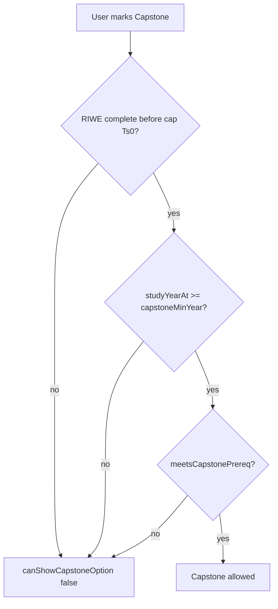
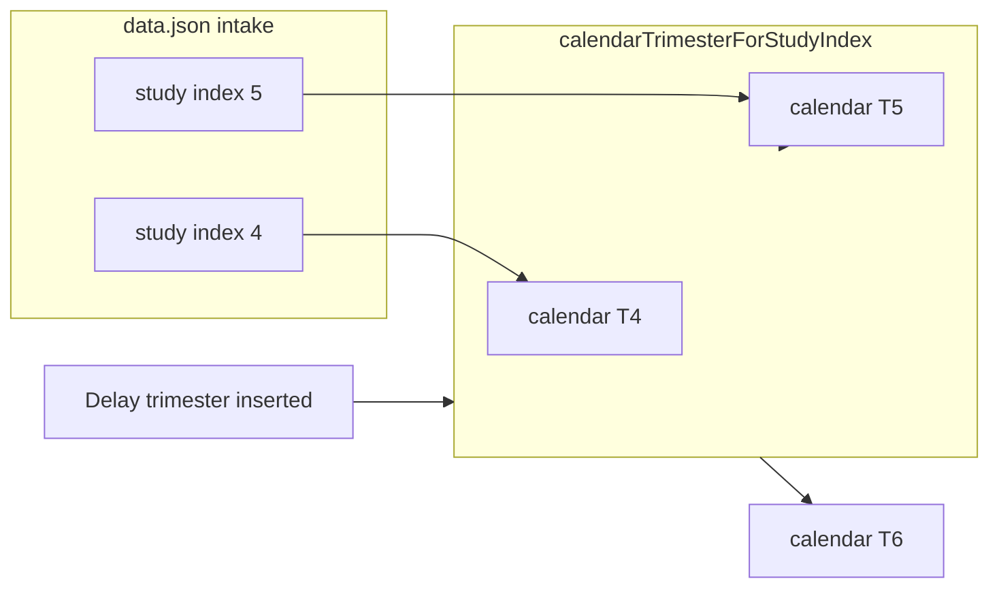

# 04 — Planner Logic (`planner.js`)

All functions live on `global.CSMPlanner` unless noted. File is an IIFE; no ES modules.

---

## Plan object

Created by `emptyPlan()`:

```javascript
{
  mc: string[14],              // primary micro-credential row
  reattemptMc: string[14],     // reattempt row (separate course per trimester)
  remoduleMc: string[14],      // remodule row (separate course per trimester)
  careerCatalystAt: null,
  riweAt: null,
  capstone: false,
  leave: boolean[14],
  reattempt: boolean[14],       // row enabled flags
  remodule: boolean[14],
  rplCredits: number[14],       // MC RPL: 0,3,6,9,12,15,18
  rplMc: (string|null)[14],
  rplWfe: boolean[14]          // WFE RPL 10 cr (Career Catalyst exemption)
}
```

**Concurrent rows:** MC, Reattempt, and Remodule can each hold a different course in the same calendar trimester. Leave blocks all rows. **Max 24 credits per trimester** across all activity in that trimester (`trimesterActivityCredits`).

**Reattempt / remodule offering window:** Only allowed in the **2 trimesters** starting when a course is offered (`reattemptOfferWindowTrimesters` + `courseRetryTrimesters`).

**RPL:** MC steps of 3 up to 18 cr; WFE RPL 10 cr; **max 90 cr RPL total** (`rplMaxTotalCredits`).

---

## Study trimester deferral (critical)

Leave, reattempt, and remodule are **planning delays**. They occupy a calendar column but do **not** advance study progression.

### Core helpers

| Function | Behaviour |
|----------|-----------|
| `isOnLeave(plan, t)` | `plan.leave[t-1]` |
| `isOnReattempt(plan, t)` | `plan.reattempt[t-1]` |
| `isOnRemodule(plan, t)` | `plan.remodule[t-1]` |
| `isPlanningDelay(plan, t)` | OR of the three above |
| `isTrimesterBlocked(plan, t)` | Same as `isPlanningDelay` |
| `studyTrimesterIndex(plan, calendarT)` | Count non-delay trimesters from 1…calendarT |
| `calendarTrimesterForStudyIndex(plan, studyIndex)` | Inverse map: study index → calendar column |
| `studyYearAt(plan, t)` | `ceil(studyTrimesterIndex(plan, t) / 3)` |

### Example

Leave in calendar T2:

| Calendar T | 1 | 2 | 3 | 4 | 5 | 6 | 7 | 8 | 9 |
|------------|---|---|---|---|---|---|---|---|---|
| Study index | 1 | — | 2 | 3 | 4 | 5 | 6 | 7 | 8 |
| Event | MC | leave | MC | MC | **RIWE** | **RIWE** | MC | MC | **Capstone…** |

Without leave, RIWE would be calendar T4–5 and Capstone T7–9. With one leave, RIWE becomes T5–6 and Capstone T8–10.

### RIWE slot mapping

Intake data: `wfeRiweTrimesters: [4, 5]` → study indices 4 and 5.

```
riweCalendarSlots(plan, intakeKey)
  = wfeRiweTrimesters.map(st → calendarTrimesterForStudyIndex(plan, st))

riweStartTrimesters(plan, intakeKey)
  = [ riweCalendarSlots[0] ]     // only first slot is assignable start

riweSpanTrimesters(plan, intakeKey)
  = 2 slots from riweAt within riweCalendarSlots (duration from prerequisites.wfeRiwe)
```

| Function | Role |
|----------|------|
| `canOfferRiwe(plan, t)` | `studyYearAt(plan, t) === constraints.wfeRiweYear` |
| `canAssignRiwe(t, plan, intakeKey)` | First calendar RIWE slot, not blocked, prereqs met, riweAt unset or this t |
| `isRiweActiveTrimester(plan, intakeKey, t)` | In span |
| `isRiweCompleteBefore(plan, intakeKey, t)` | `t > lastRiweTrimester` |
| `riweCellTrimesters(plan, intakeKey)` | Set of columns to show RIWE UI |
| `sanitizePlanSchedule(plan, intakeKey)` | Clears `riweAt` if no longer at valid start after delay changes |

### Capstone slot mapping

```
capstoneTrimestersFor(plan, intakeKey, maxT)
  = capstoneTrimesters study indices → calendar, filtered ≤ maxT

canStartCapstone(plan, t)
  = studyYearAt(plan, t) >= constraints.capstoneMinYear
```

Capstone **credits** (16) counted once at `capTs[0]` in `cumulativeCredits` / `creditBreakdown`.

---

## Micro-credentials

### Offering filter

`coursesOfferedInTrimester(intakeKey, t, plan)`:

- Month from `monthForTrimester`
- IDs from `offeringsByMonth[month]`
- Excludes already-used MCs (unique ids)
- If both foundations already scheduled elsewhere, excludes foundation category

### Assignment rules

| Function | Rule |
|----------|------|
| `canAssignMc(t, plan)` | Not blocked; not CC trimester; not reattempt trimester |
| `canAssignCareerCatalyst(t, plan)` | Feature on; not blocked; no MC in same tri; CC not elsewhere |

### Attempt limits

- `countCourseAttempts(plan, courseId)` — counts entries in `plan.mc` (reattempts/remodules count)
- Max **3 attempts** per course id — validated in `analyze`

### Reattempt

`applyReattempt(plan, t)`:

- Requires `t >= 2`
- Sets `plan.mc[t-1] = plan.mc[t-2]`
- Fails if would exceed 3 attempts

UI: toggling reattempt clears MC slot and calls `applyReattempt`.

### Remodule

`coursesForRemodule(plan, t, intakeKey)` — prior unique MCs with &lt;3 attempts, respecting `usedCourseIds` for that trimester.

---

## Prerequisites

```javascript
countMcBefore(plan, startTrimester)
  // MCs in plan.mc before t, plus full RPL exemptions (rplCredits >= mcCredits + rplMc set)

meetsRiwePrereq(plan, startTrimester)
  = mcBefore >= wfeRiwe.minMc
    OR (mcBefore >= wfeRiwe.altMinMc AND hasCareerCatalystBefore(plan, startTrimester))

meetsCapstonePrereq(plan, startTrimester)
  = mcBefore >= capstone.minMc
    OR (mcBefore >= capstone.altMinMc AND hasCareerCatalystBefore(...))
```

---

## Credit counting

### `creditBreakdown(plan)`

Returns `{ mc, foundation, stackable, wfeCc, riwe, capstone, rpl, total }`.

1. Unique MCs from `plan.mc` (each id counted once)
2. Full RPL exemptions: `rplCredits[i] >= mcCredits` with `rplMc[i]` → add MC credits to `mc`/`foundation`/`stackable`
3. Partial RPL: other positive `rplCredits` → `rpl` bucket
4. `wfeCc` if `careerCatalystAt != null`
5. `riwe` if `riweAt != null`: `durationTrimesters × riweCreditsPerTrimester`
6. `capstone` if `plan.capstone`

### `cumulativeCredits(plan, intakeKey, throughT)`

Running total through calendar trimester `throughT`:

- Same MC dedup as breakdown
- RPL per trimester in loop order
- RIWE per trimester in span; **skips leave** (not other delays) for RIWE credit accrual in that trimester
- Capstone at first calendar capstone trimester in range

### Auto-extension

`suggestedExtensionTrimesters(plan, intakeKey)`:

- While credits &lt; total AND all visible trimesters have *some* selection AND extension &lt; max:
  - increment extension count
- `applyAutoExtension()` in UI bumps `#programmeDuration` select

`hasSelectionInTrimester` treats MC, CC, RIWE, capstone span, RPL &gt; 0, leave, reattempt, remodule as "occupied".

---

## RPL

| Function | Role |
|----------|------|
| `rplMaxPerTrimester()` | From data (24) |
| `rplCreditSteps()` | `[0,6,12,18,24]` |
| `cycleRplCredits(current)` | Next step in cycle |
| `rplCreditsAt(plan, t)` / `rplMcAt(plan, t)` | Accessors |
| `coursesForRpl(plan, t)` | MCs not in `uniqueMcIds` (except current pick) |
| `uniqueMcIds(plan)` | Scheduled MCs + full RPL exemptions |

**Semantics:**

- 6 / 12 cr: partial credit toward 180 only
- ≥ 18 cr + `rplMc`: counts as completing that MC for counts and prereqs
- Max 24 cr per trimester (validated in `analyze`)
- Cannot duplicate an MC already in `plan.mc`

---

## Validation — `analyze(plan, intakeKey)`

Returns:

```javascript
{
  counts: { foundation, stackable, mc },
  breakdown: { ... creditBreakdown },
  issues: [ { type: 'error'|'warn'|'info', msg: string } ],
  ready: boolean
}
```

**`ready`** when: no errors, `counts.mc === mcCount`, CC/RIWE/capstone satisfied (if features on), `breakdown.total === totalCredits`.

Major checks:

- MC on leave trimester (not reattempt/remodule)
- MC + CC same trimester
- Offering month mismatch (except reattempt/remodule)
- &gt;3 attempts per course
- Foundation/stackable/MC counts and required foundation names
- Delay trimester info message (deferral)
- RPL cap and duplicate MC
- RIWE study year, start slot, prereq, not on delay
- Capstone study year, prereq, RIWE complete
- Credit total vs 180

---

## Plan generation

### `defaultPlan(intakeKey)`

Builds from `idealFirstAttempt` — **exported but unused by UI**. Sets `riweAt` via `calendarTrimesterForStudyIndex` with no delays.

### `suggestPlan(intakeKey)`

Heuristic fill:

1. `assignMicroCredentials` — two passes over core trimesters, scored by `scoreMcForSuggest` (foundation bias, ML before genai, etc.)
2. `findCareerCatalystTrimester` — prefers ≥2 MCs before, t≥3
3. `firstRiweOfferTrimester` → `riweAt`
4. `capstoneTrimestersFor` + `canShowCapstoneOption` → `capstone` boolean

Does not set leave/reattempt/remodule/RPL.

---

## Public API reference (grouped)

### Data / programme

`loadData`, `setData`, `getData`, `applyProgram`, `listPrograms`, `getActiveProgramId`, `getRegistry`, `hasFeature`, `getMinCohortYear`, `getDefaultCohortYear`, `EMPTY`

### Calendar / labels

`monthForTrimester`, `yearForTrimester`, `triInYear`, `trimesterMeta`, `trimesterCalendarStart`, `academicYearForMonth`, `cohortLabel`, `cohortParts`, `ayPalette`, `colsForTriRange`, `rowLabelText`, `buildAyGroups`, `ayGroupForTrimester`, `trimesterLabel`

### Courses / tiles

`tilesForTrimester`, `coursesOfferedInTrimester`, `coursesGrouped`, `courseById`, `selectionLabel`, `formatTileLabel`, `formatCatalogRefLabel`, `isCourseOfferedInTrimester`

### Plan lifecycle

`emptyPlan`, `defaultPlan`, `suggestPlan`, `analyze`, `sanitizePlanSchedule`

### Credits

`creditBreakdown`, `cumulativeCredits`, `countMcBefore`, `uniqueMcIds`, `suggestedExtensionTrimesters`, `allVisibleTrimestersOccupied`, `hasSelectionInTrimester`, `hasPlanFromTrimester`, `firstPlannedTrimester`, `showCumulativeAtTrimester`

### Components (CC / RIWE / Capstone)

`componentName`, `componentAvailability`, `canAssignCareerCatalyst`, `canOfferRiwe`, `canShowRiweOption`, `canAssignRiwe`, `riweStartTrimesters`, `riweCellTrimesters`, `riweSpanTrimesters`, `isRiweActiveTrimester`, `firstRiweOfferTrimester`, `isRiweCompleteBefore`, `lastRiweTrimester`, `riweCreditsPerTrimester`, `riweTrimestersForIntake`, `canStartCapstone`, `canShowCapstoneOption`, `meetsRiwePrereq`, `meetsCapstonePrereq`, `capstoneTrimestersFor`

### Delays

`isOnLeave`, `isOnReattempt`, `isOnRemodule`, `isPlanningDelay`, `isTrimesterBlocked`, `studyTrimesterIndex`, `studyYearAt`, `applyReattempt`, `coursesForRemodule`, `countCourseAttempts`, `canAssignMc`

### RPL

`rplMaxPerTrimester`, `rplCreditsAt`, `rplMcAt`, `cycleRplCredits`, `coursesForRpl`

---

## Flow diagram: capstone gating



---

## Flow diagram: deferral → RIWE shift



When delays are added, indices 4 and 5 map to later calendar columns automatically on next `render()` via `sanitizePlanSchedule` + UI slot builders.
